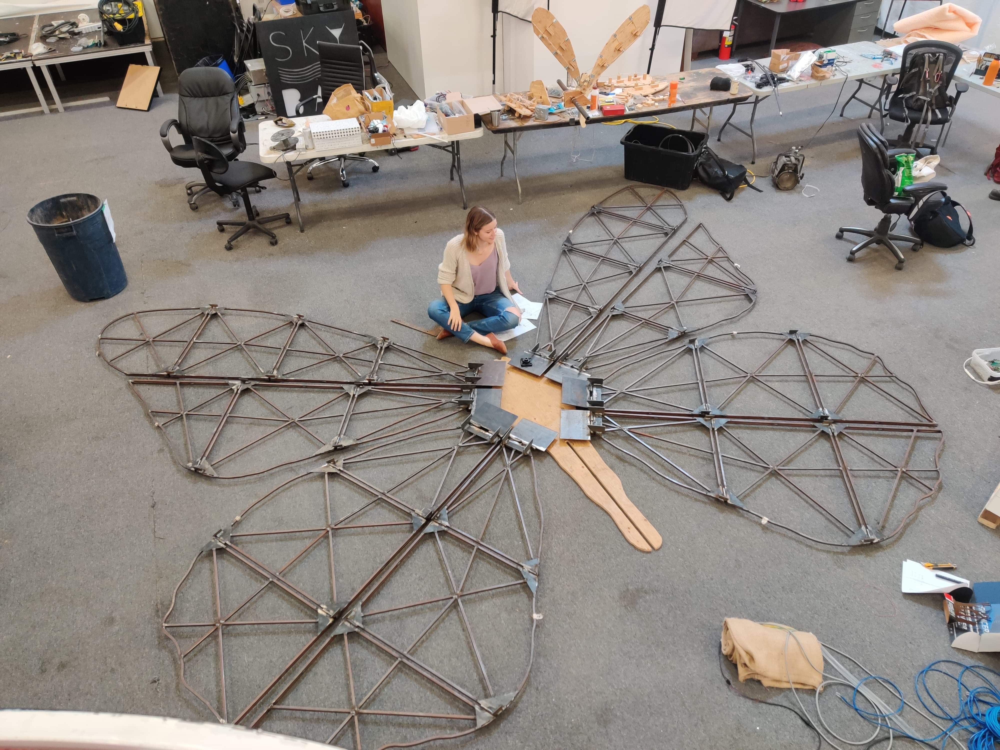

# chrysafly-motion
## By Michelle Koo, Emma Gray, Evan Pham and Tyler Keeling
**Chrysafly is a gigantic, 6-metre tall mechatronic butterfly. This is the code used for motor control, calibration and feedback systems that allow the system to fold and unfold both automatically and on-command.**

